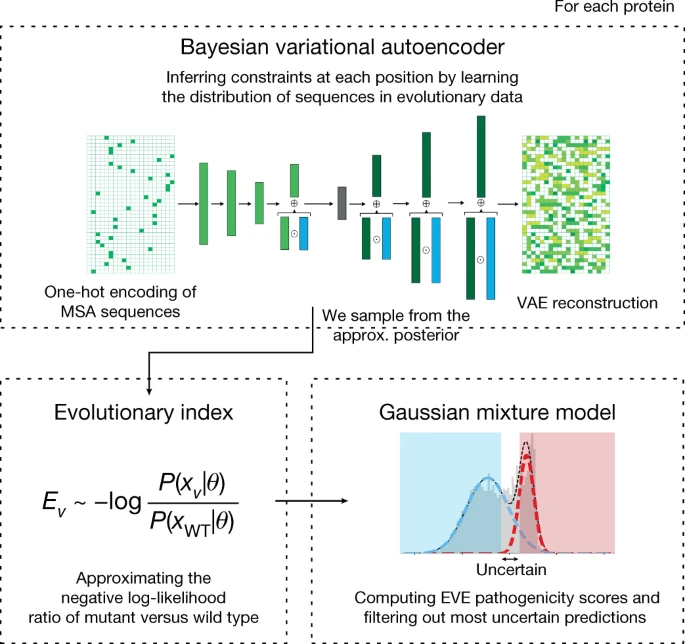

# ncEVE: Pathogenicity Prediction of Non-Coding Genomic Variants

## Overview

Back in 2022, I was in search of the next project in research. I learned about the work of Frazer et al., 2021 published in the paper ["Disease variant prediction with deep generative models of evolutionary data"](https://www.nature.com/articles/s41586-021-04043-8). The paper presented a way to score the pathogenicity of *coding* genomic variants that changes the sequences of amino-acid in a protein. I tried to quickly adapt this model to whole-genome sequence data, such that we can theoretically score the pathogenic effects of *non-coding* variants.


**EVE**: Fraser et al. trained a Bayesian Variational Autoencoder (VAE) to reconstruct the alignment of amino acid sequences between human and other species. **Hence, each model is trained on a single-protein's sequence alignment**. The original model focuses on coding sequences, leveraging evolutionary data to predict the impact of amino acid changes on protein function and associated disease risk.


Figure 1: EVE framework, cited from [Fig. 1 from Frazer et al., 2021](https://www.nature.com/articles/s41586-021-04043-8/figures/1)

**ncEVE**: I worked with whole genome sequence alignment between human and 100 other species in the animal kingdom in this project (data from UCSC Genome Browser's 100-multiway). Hence, for each window of $N$-bp in the genome, we can in principle apply similar frameworks applied in Frazer et al., 2021 to the non-coding sequence data. Non-coding sequences, while not directly altering protein sequences, can have significant regulatory roles and contribute to disease risk through mechanisms affecting gene expression, splicing, and other regulatory functions.

*The ncEVE idea did not pan out as effective for the intended purpose because I did not find the prediction from ncEVE more informative than other measures of evolutionary constraint of genetic variants, such as [consHMM](https://www.nature.com/articles/s42003-019-0488-1). However, I still share the code of of this exploration here for archival and show-case for people who potentially evaluate my capacity with data analysis and ```pytorch```.*

Along the way, I cleaned up the structure of EVE's code, shorten functions, added functions to save different model entities and of course, changed the data-loader and output format. I also added ```utils```  which contains code (```python``` and ```snakemake```) to process input data from multi-sequece alignment. File structure of an ncEVE model: 
```
├── evol_indices
│   ├── test_data_recon_prob.txt.gz: unnomalized reconstruction probabilities, i.e. probabilities that each genetic variant should be present based on the trained model. Since the prob. are not normalized, the sum across 4 different possible bases A,C,T,G does not sum to 1
│   └── test_data.txt.gz: the official evol_indices as described in EVE, i.e. high values imply the variant are less likely to occur than the wild-type variant.
├── logs
│   ├── command.logs: the script command used to run the model
│   └── simulation_losses.csv
├── train_data
│   ├── test_data.txt.gz
│   └── train_data.txt.gz
└── VAE_parameters
    └── simulation_step_41000: binary file storing the model parameters
```
The input data should look like: 


Input into ncEVE, first 3 columns include data about the position in the genome of the variant of interest, and the following columns show the letters (A, C, T, G) or alignment failure (X) in each of the other 100 species with the human genome. 

The output data file ```evol_indices/<user_defined_fn>.txt.gz``` storing the unnormalized probability of each genomic variant present at each genomic position of interest: 


Output of ncEVE. Each column shows the information about the genomic position, the consHMM conservation states that the variant is in (if you dont know what that means, ignore it for now), and the probabilities that of each letter being present at each position. 


## References

- Frazer, J., Notin, P., Dias, M., Gomez, A., Min, J. L., Brock, K., ... & Marks, D. S. (2021). Disease variant prediction with deep generative models of evolutionary data. *Nature Genetics*, 53(6), 759-768. doi:10.1038/s41588-021-00856-2

## License

This project is licensed under the MIT License.

## Acknowledgments

We acknowledge Frazer et al. (EVE's authors) for their pioneering work and for providing a framework that facilitated this adaptation.
